<!-- ═══════════════════════════════════════════════════════════════ -->
<!--                         HERO BANNER                            -->
<!-- ═══════════════════════════════════════════════════════════════ -->

<p align="center">
  <picture>
    <source media="(prefers-color-scheme: dark)" srcset="./dark.svg">
    <source media="(prefers-color-scheme: light)" srcset="./light.svg">
    
  </picture>
</p>

<br>

<!-- ═══════════════════════════════════════════════════════════════ -->
<!--                           IDENTITY                             -->
<!-- ═══════════════════════════════════════════════════════════════ -->

<h1 align="center">Prateek Shrivastav</h1>

<p align="center">
  <strong>B.Tech Student · Developer · Builder</strong>
</p>

<p align="center">
  <code>Building + Learning + Shipping</code>
</p>

<p align="center">
  <a href="https://github.com/ptkgr8-stack">
    
  </a>
  
  
  
</p>

---

## `> whoami`

```text
NAME        Prateek Shrivastav
ROLE        B.Tech Student / Developer / Builder
FOCUS       AI • Full-Stack • Cybersecurity
CURRENTLY   Building real-world software products
STATUS      Learning → Building → Breaking → Fixing → Shipping
```

I'm a Computer Science student who enjoys turning ideas into working software.

I like exploring the intersection of **AI, software engineering, cybersecurity and product building** — from writing backend APIs to experimenting with mobile applications and intelligent systems.

Currently learning, building, breaking things, fixing them and shipping again.

---

## `> about_me`

- 🎓 B.Tech student in **Computer Science & Engineering — AI**
- 🤖 Interested in **Artificial Intelligence & Machine Learning**
- 📱 Building with **Flutter**
- 🌐 Building web interfaces with **React**
- ⚙️ Working with **Python & Flask**
- 🗄️ Using **PostgreSQL & SQLite**
- 🧠 Exploring **PyTorch, OCR & intelligent automation**
- 🔐 Exploring **Cybersecurity & network security**
- 🧩 Interested in **offline-first systems, synchronization & distributed systems**
- 🚀 Building ideas into real products

---

# `> tech_stack`

### Languages

<p>
  
  
  
  
  
</p>

### Frontend / Mobile

<p>
  
  
  
  
</p>

### Backend / Database

<p>
  
  
  
</p>

### AI / Intelligent Systems

<p>
  
  
</p>

### Systems / Connectivity

<p>
  
  
  
  
  
  
</p>

---

# `> featured_project`

## 🧳 MUSUBI

> **A smarter way to manage money during group trips.**

MUSUBI is an **offline-first group expense and settlement platform** designed around the idea of making trip money management almost automatic.

Instead of manually calculating who paid what, who owes whom and how everyone should settle, MUSUBI brings expenses, payments, OCR and settlement into one system.

### Core idea

```text
CREATE TRIP
     ↓
INVITE FRIENDS
     ↓
ADD EXPENSES
     ↓
UNDERSTAND WHO PAID
     ↓
CALCULATE WHO OWES WHOM
     ↓
OPTIMIZE SETTLEMENTS
     ↓
SYNC EVERYTHING
```

### Built around

- 📱 Flutter mobile application
- 💾 SQLite local storage
- 🤖 AI-assisted receipt processing
- 🔎 Google ML Kit OCR
- 🔄 CRDT-based offline synchronization
- 📡 Bluetooth LE + Wi-Fi connectivity
- 📍 GPS + BLE based safety capabilities
- ⚙️ Flask backend
- 🐘 PostgreSQL database

> **Create. Connect. Explore.**

---

# `> other_work`

### 🛡️ KavachX

An AI-oriented network security project focused on analysing network traffic and identifying behavioural patterns that may indicate future attacks.

```text
Network Traffic
      ↓
Data Collection
      ↓
Time-Based Analysis
      ↓
Behaviour Detection
      ↓
Pattern Learning
      ↓
Attack Forecasting
      ↓
Probability + Explanation
      ↓
Security Alert
```

### What I worked with

- Python
- FastAPI
- PostgreSQL
- Authentication systems
- JWT
- SQLAlchemy
- REST APIs
- Git / GitHub

---

# `> engineering_interests`

```text
┌─────────────────────────────────────────────────────────┐
│                                                         │
│  ARTIFICIAL INTELLIGENCE                                │
│  ├── Machine Learning                                   │
│  ├── Computer Vision                                    │
│  ├── OCR                                                │
│  └── Intelligent Automation                             │
│                                                         │
│  SOFTWARE ENGINEERING                                   │
│  ├── Backend Systems                                    │
│  ├── REST APIs                                          │
│  ├── Databases                                          │
│  └── Full-Stack Development                             │
│                                                         │
│  DISTRIBUTED SYSTEMS                                    │
│  ├── Offline-First Architecture                         │
│  ├── CRDT                                               │
│  ├── Synchronization                                    │
│  └── Mesh Connectivity                                  │
│                                                         │
│  CYBERSECURITY                                          │
│  ├── Network Security                                   │
│  ├── Authentication                                     │
│  └── Security-Aware Systems                             │
│                                                         │
└─────────────────────────────────────────────────────────┘
```

---

# `> github_analytics`

### GitHub Activity

<p align="center">
  
</p>

<p align="center">
  
</p>

---

# `> contribution_activity`

<p align="center">
  
</p>

---

# `> contribution_snake`

<p align="center">
  <picture>
    <source
      media="(prefers-color-scheme: dark)"
      srcset="https://raw.githubusercontent.com/ptkgr8-stack/ptkgr8-stack/output/github-contribution-grid-snake-dark.svg"
    >
    <source
      media="(prefers-color-scheme: light)"
      srcset="https://raw.githubusercontent.com/ptkgr8-stack/ptkgr8-stack/output/github-contribution-grid-snake.svg"
    >
    
  </picture>
</p>
<p align="center">

<a href="https://github.com/ptkgr8-stack">
  
</a>

&nbsp;&nbsp;

<a href="https://www.linkedin.com/in/prateek-shrivastav-093a51316/">
  
</a>

&nbsp;&nbsp;

<a href="https://www.instagram.com/_praateekk_/">
  
</a>

&nbsp;&nbsp;


</p>

---

# `> current_status`

```text
┌──────────────────────────────────────────────────────┐
│                                                      │
│  BUILDING       ████████████████████░░░░  80%        │
│  LEARNING       █████████████████████░░░  85%        │
│  SHIPPING       ████████████████░░░░░░░  70%        │
│                                                      │
│  SYSTEM.STATUS  ONLINE                               │
│  MODE           BUILD                                │
│                                                      │
└──────────────────────────────────────────────────────┘
```

---

<p align="center">
  <i>Build things. Break things. Learn things. Ship things.</i>
</p>

<p align="center">
  <code>© Prateek Shrivastav</code>
</p>
